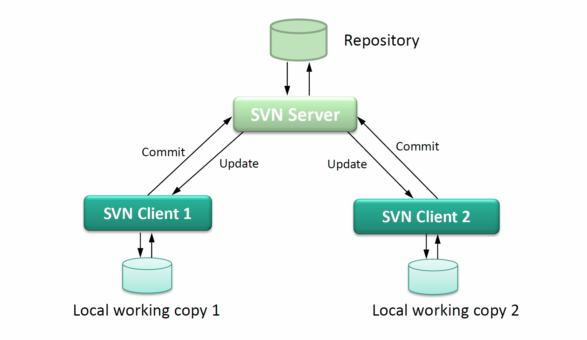
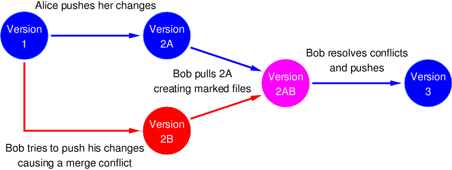

# Git Introduction

_Protocol Mon, Sept 26, 22 by Julia Meyr. Reviewed Schröder Sept 28, 22_

## Architecture

The **feature** of Git is **revolutionary** compared to other software version control systems, because of its flexible distributed architecture.

### Server-Based VCS



- Previous versioning systems were **server-based**, with a single central repository on the server.
- For example **Subversion** (svn, _reference_: https://codentrick.com/architecture-and-design-of-subversion-svn-part-1/):

- There is one SVN server, and many SVN clients, all of which have **created a clone** (similar to git)
  - `clone` essentially means a **copy of the central-repository** is created
  - Later you can `update` your copy.
  - As soon as someone has changed any files, there is a `commit` command, which immediately sends the modified or added files to the server repository.

### Git: Distributed Architecture

<div>
  

_Reference_: https://www.geeksforgeeks.org/git-features/

</div>

With git, each client maintains not only a simple _working copy_, but a **local repository**, which is a full copy of the remote repository, and is able to stage and commit modifications, or create branches, in its own local repository.

- You can chose when to push changes to the remote.
- Further, with this local repository, it is very easy to push this repository to different other remote repositories. So you are not limited by a single central server repository.

## Git Workflow Overview


_Reference_: https://medium.com/mindorks/what-is-git-commit-push-pull-log-aliases-fetch-config-clone-56bc52a3601c

### Cloning Repositories

```bash
git clone [url]
```

Retrieves an entire repository from a hosted location via URL

`git clone` has cloned the repository from this remote address (URL), with cd you can now get into the git folder, where the database is located.

```bash
ls -al
```

you see the `.git`-folder linked to remote, so the git commands know where to put the files.

:bulb: If you **don't have a .git folder** in your folder, you can try to do as many git commands as you want but **nothing** will work!

### Staging Area

- in our staging area in VS Code (Source Control) we have **add all files** that are known to be **modified**
- git does not do anything with empty folders, so those will be **ignored**
- if you want to push a file you have to put it into the staging area at least before you commit and push it
- the staging area is used to **check your changes** in all modified files before you commit them to your local repository. This is **especially convenient and important** if you have a lot of files to commit.

Check the status of your local working copy (untracked files, staged files) with

```bash
git status
```

#### Staging Example

If you are in a team and have 27 files in a project and want to upload all of them, you have 2 variants to do this:

1.  **and we do not do this!**: you add all files in one go to the staging area and commit and push all files immediately
2.  Correct workflow:
    - You inspect all files **piece by piece** and review, if your changes are fine and complete.
    - Each file is added to the staging area one by one
      - => use `git add <filename>` or `+` in VS Code.
    - If all files belonging to a specific type of change are staged, you can commit them with a proper commit message.
      - => use `git commit -m "my serious commit message"` for committing all files from the staging area
    - You proceed with the remaining files and collect all belonging to a specific type of change: Review, stage. If all files are ready => commit with a proper commit message.
    - Finally, if all commits are done and no local untracked changes are left
      - => push your commits to the remote with `git push`.

The staging area is cool when you have **a lot of changes**. When you are done you have a **clean state ready to commit**.

:bulb: **`We always make a review during staging!`**

- Because sometimes you do 3 things at once and if your team mates need to find out what you have changed, they need to look through 27 files to find the right change, thats not funny.
- Better split the 27 files in smaller commit chunks.

If a commit doesn't fit you can revert it with `git reset`.

### .gitignore

How to prevent certain file & folder types (like temporary files and build outputs - see **node_modules**) from being _added_ by git? **.gitignore!**

- Use https://www.toptal.com/developers/gitignore/ to generate a proper file for your specific environment and toolchain.

### Stage & Commit


- shows you all modified files in the working directory, either still untracked or staged for your next commit:

```bash
git status
```

- adds an untracked file as it looks now to your staging area:

```bash
git add [file]
```

- adds all modified and new files to your staging area:

```bash
git add .
```

- commit your staged content as a new commit snapshot:

```bash
git commit -m "[individual descriptive message]"
```

### Pushing, Pulling, and Merge Conflicts

- transmit local branch commits to the remote repository branch:

```bash
git push [alias] [branch]
```

If you have changed a file and want to push it, but someone else in our team has pushed a change in the same file and in the same line, we have a _merge conflict_. Git now forces you to pull, and will enter a **merging state** immediately after the pull:

- Look in the file having the merge conflict:
  - "Their changes" are the conflicting lines coming in from the remote repository
  - "Your changes" are the conflicting lines in your local repository
- You need to decide, how the correct version shall look like.
- :bulb: You need to ensure that the merge comments (see `<<<<<<` and `>>>>>>`) which have been added by git are completely removed, before commiting your merge conflict resolution!



_Reference_: http://www.cs.utsa.edu/~cs3443/git/merge-conflicts.html

### Stashing

If you don't want to run into such a merge process without loosing the current changes in your local working directory, you can stash those changes:

- Call `git stash`.
- After stashing, your working copy is clean and you can savely `pull` the changes from the remote repository.
- To recover your changes from the stash, call `git unstash`

That's what the `stash` is for: it's a **local working stack** in which you can "store" incomplete changes temporarily so that you can proceed working on them later.

## Branch & Merge

To avoid running into daily _merge conflicts_, there is **branching**.

- After **each commit** a new **version node** is created
- For each syp project, each and everyone pulls away personal **development branches**

  - Everyone in the team/project is now completely alone with him/herself on this branch
  - Each commit from each branch again is a new version node

<div style="float:right">
    

**Reference**: https://www.nobledesktop.com/learn/git/git-branches

</div>

### Create a branch

Ensure you are sitting on the latest revision of the correct branch, from where you want to branch away.

- Create a local branch in your local repository:

```
git branch [my-branch-name]
```

- Switch to this local branch:

```
git switch [my-branch-name]
```

- Modify, add and commit your files to this local branch.
- Finally, if you want to push the local branch to the remote repository, you need to define the branch name in the remote repository to create a link between the local and the remote branch. Just follow the git instructions!

```
git push origin [my-branch-name]
```

### Merging branches to main

As often as possible, the individual versions should be _merged onto the main line_, so the same process starts again from there, but everyone works with an **improved version**, having changes from the team mates available.

- Either you select a _merge master_ (often project leader), who then merges a branch back to the mainline, such as: Prof. Schröder with the student talk topics. Use `pull requests` for this workflow!
- Or each developer is responsible for merging his or her own branch into the main line

:bulb: In any case, you need to test the main line carefully after your merge, to see if everything still works fine!

### Rebasing

Before you can merge your branch back to main, you need to ensure, that your branch is updated with all the changes from the main line. So actually you need to merge main into your branch, first!

- First check if you are sitting on the current local branch:

```bash
git branch -a
```

- a \* will appear next to the currently active branch, with the param **-a** we see the branch where we currently are

- Second, switch to main branch and pull the latest changes from the remote:

```bash
git switch main
git pull
```

- Next, switch back to your own local branch and merge main into your branch:

```bash
git switch [my-branch-name]
git merge main
```

- Solve any **merge conflicts** and **commit** the conflict resolutions into your local branch.

- After that, your branch is a combination of the latest main versions plus your own modifications. You must `push` this state to the remote, when the final merge to main will be done via a `pull request`.

- Otherwise, if you want to merge your local branch to main on yourself, switch to main and merge your branch into it. This is now save and wont result in any merge conflicts anymore:

```bash
git switch main
git merge [my-branch-name]
```

- Push the merge result on main to the remote to make it available for your team mates:

```bash
git push
```

### Pull Requests

To manage merging branches into main more conveniently, you can submit a **pull request** in the Github browser:

- Select the branch which shall be merged
- Select the target branch

A pull request is basically nothing more than a request made to have changes to the code merged into the master branch (simplified: "git merge").

:bulb: Ensure, as explained above, that your branch is up-to-date with the latest main version => so **rebase first!**

With a pull request,

- developers can **discuss proposed changes** via a user-friendly web interface before they are incorporated into the main line
  - => so the incoming changes from the branch are reviewed by the team, before the merge is done.
- You can also commit improvement modifications to the branch during this review process, before the final merge to main is done => also called **follow-up-commits**.

## See also

- https://www.youtube.com/watch?v=M2tz-GASzR8
- https://learngitbranching.js.org
