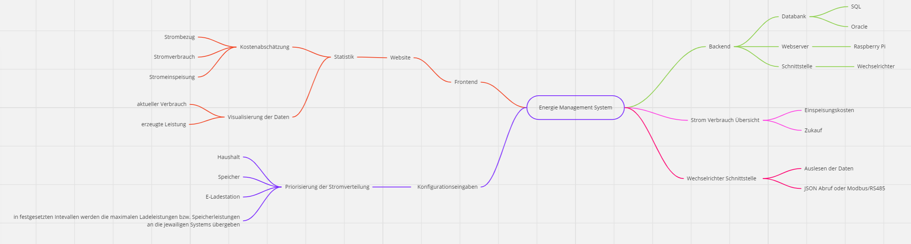
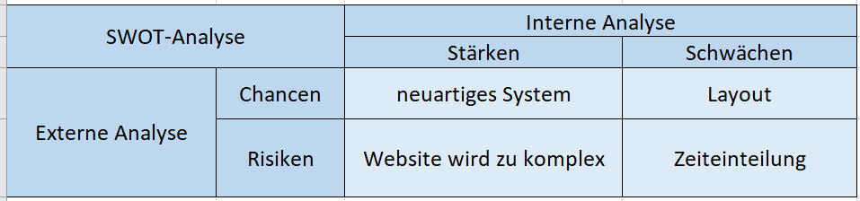

# Energie Management System - EMS 
_Julian Kapl, Maximilian Seebacher, Paula Sierzega_

## 1. Ausgangslage

### 1.1. Ist-Situation

Die vorhandenen Komonenten sind:
- Huawei Wechselrichter und Speicher
- KEBA Ladestation

**Es besteht eben noch kein User Interface für eine derartige Steuerung, genau dass ist das Ziel des Projekts.**

Ein Energie Management System als Übersicht über die Daten der PV Anlage. 
Ziel ist es, Daten zusammenzuführen von den verschiedenen Energie Verbrauchern und Energie Generatoren in einem Haushalt. 

Bestehende Systeme sind nur darauf abgestimmt, dass alle Komponetnen vom gleichen Hersteller stammen müssen.
Da jedoch sehr viele Komponenten im Einsatz sind, ist es oft sehr schwierig alles nur voneinem Hresteller zu verwenden
z.B: produzieren die wenigsten Wechselrichter Hersteller auch E-Auto Ladestationen und Speicher.

### 1.2. Verbesserungspotenziale

#### Probleme
- Hersteller offenes System zur Steuerung der Energie Verteilung existiert unseres Wissens in dieser Form noch nicht
- Kosten werden nicht gut aufgezeigt
- keine statistischen Informationen

#### Verbesserungen
- Gute Übersicht über den aktuellen Verbrauch / Stromzufuhr
- Verwaltung der Energie
- Ladestand Speicher
- Kompatibilität verschiendener Herrsteller ermöglichen

## 2. Zielsetzung

- Das Ziel ist die Steuerung des Baterie Speichers und der Ladestation.
- Das System soll die Priorisierung ermöglichen.
- Unser Ziel ist die Veranschaulichung des Stromverbrauches und des Stromgewinns zu verbessern.
- Selbsterzeugten Strom bestmöglich zu verwenden und erst dann die überschüssige Energie ins Netz einzuspeisen.

### Soll-Zustand

Es gibt zwei Möglichkeiten um die überschüssige Energie selbst zu verwenden, je nach Priorisierung wird zuerst der Haus interne Speicher zur Ladung verwendet oder das E-Auto über die Ladestation.

Die Daten sind gut visualisiert.

MindMap

## 3. Risikoanalyse

#### Chancen

- Produkt füllt eine Marktlücke 

#### Projektrisiken

- Website könnte zu komplex werden
- Troubleshoot bei den Schnittstellen
- Zeiteinteilung

#### SWOT-Analyse

## 4. Projektablauf

#### Rahmenbedingungen

- **Personell**
    - Klare Rollenverteilung
    - Gegenseitige Unterstützung
    - Entscheidungen untereinander Abstimmen

#### Meilensteine

- **Wintersemester**
    - Genehmigung des Projektantrags
    - Website Gestaltung (Wireframe)
        - Demo mit Testdaten
    - Datenbank Erstellen und die Testdaten einlesen

- **Sommersemester**
    - Webserver
    - Schnittstellen zwischen den Komponenten

