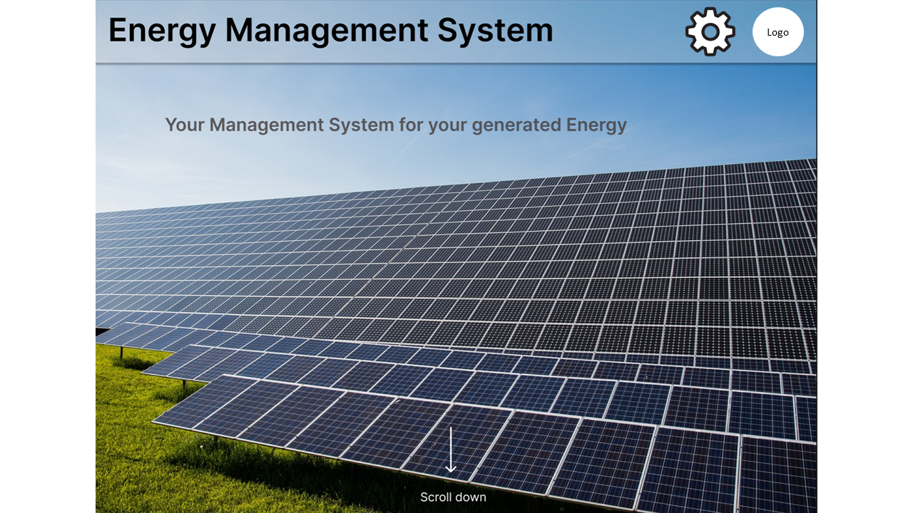
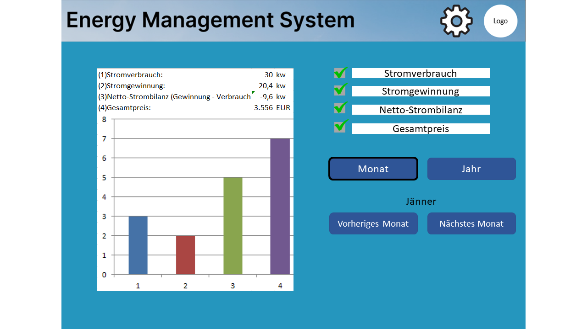
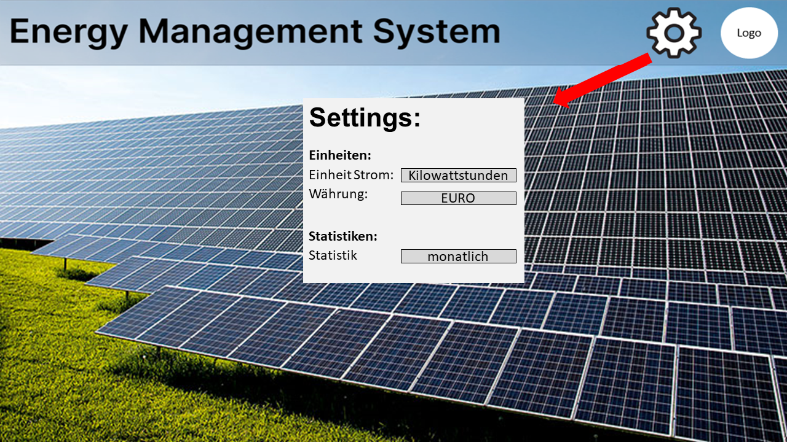
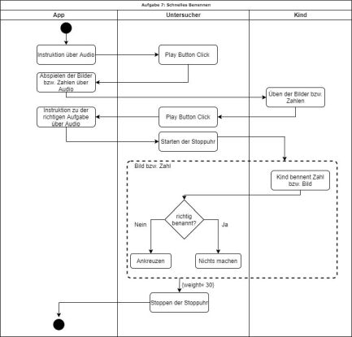

# System-Spezifikation `EMS - Energie Management System`

## 1. Ausgangslage und Zielsetzung

### 1.1. Ist-Situation
Die vorhandenen Komponenten sind:
- Huawei Wechselrichter und Speicher
- KEBA Ladestation

**Es besteht noch kein User Interface für eine derartige Steuerung, dass ist das Ziel des Projekts.**

Ein Energie Management System als Übersicht über die Daten der PV-Anlage. 
Ziel ist es, Daten zusammenzuführen von den verschiedenen Energie Verbrauchern und Energie Generatoren in einem Haushalt. 

Bestehende Systeme sind nur darauf abgestimmt, dass alle Komponenten vom gleichen Hersteller stammen müssen.
Da jedoch sehr viele Komponenten im Einsatz sind, ist es oft sehr schwierig alles nur von einem Hersteller zu verwenden
z.B.: produzieren die wenigsten Wechselrichter Hersteller auch E-Auto Ladestationen und Speicher.

### 1.2. Verbesserungspotenziale

#### Probleme
- Hersteller offenes System zur Steuerung der Energie Verteilung existiert unseres Wissens in dieser Form noch nicht
- Kosten werden nicht gut aufgezeigt
- keine statistischen Informationen

#### Verbesserungen
- Gute Übersicht über den aktuellen Verbrauch / Stromzufuhr
- Verwaltung der Energie
- Ladestand Speicher
- Kompatibilität verschiedener Hersteller ermöglichen

## 2. Zielsetzung

- Das Ziel ist die Steuerung des Batterie Speichers und der Ladestation.
- Das System soll die Priorisierung ermöglichen.
- Unser Ziel ist die Veranschaulichung des Stromverbrauches und des Stromgewinns zu verbessern.
- Selbsterzeugten Strom bestmöglich zu verwenden und erst dann die überschüssige Energie ins Netz einzuspeisen.

## 2. Funktionale Anforderungen

### 2.1. Use Case Überblick

### 2.2.1 GUI-Design

- GUI-Mockup der Start Seite

### 2.2. Use Case Statistik

Es wird von einer Datenbank eine Statistik generiert, die durch Auswahlmöglichkeiten veränderbar ist. Dies geschieht durch abhackerln der jeweiligen Alternativen auf der rechten Seite. Weiters kann das Jahr und das jeweilige Monat auf der Statistik angezeigt werden. Dies geschieht durch den Button vorheriges Monat und nächstes Monat.  
### 2.3. Use Case Settings

 Bei den Settings geht es um die Eigenschaften der Tabelle. Wie die Einheit des Stroms den man produziert oder die Währung. Wie viel man für den Strom bekommt wenn man in weiterverkauft. Weiters kann man den Zeitabschnitt angeben(pro Monat oder Jahr).

#### 2.2.2 Workflow

- Erklären Sie hier die internen Abläufe, die für die Umsetzung des Use Cases notwendig sind
- Verwenden Sie dazu - wenn der Ablauf komplex genug ist - ein `UML Activity Diagram`
- Beispiel:

## 3. Nicht-funktionale Anforderungen

### `Usability`: Benutzbarkeitsanforderung
- Die Statistiken der Website sollten übersichtlich und     informationsreich dargestellt sein

- Benutzerfreundiche strukture der Website

### `Efficiency`: Effizienzanforderung

- Das Auswerten der Daten darf nicht länger als 10 Sekunden benötigen um den Benutzer nicht abzuschrecken -> Datenbank erstellen

### `Maintenance`: Wartbarkeits- und Portierbarkeitsanforderung

- Es müssen neue Daten vom Wechselrichter zur Datenbank hinzugefügt werden können ohne viel Aufwand zu betreiben
### `Security`: Sicherheitsanforderung

- Das System muss gewhärleisten das der Benutzer auf seine Daten zugreifen kann und sonst kein anderer

- Virenfreie Daten hochladen

- Sichere Verbindung zum Server

### `Legal`: Gesetzliche Anforderung

- Persöhnliche Daten dürfen nicht weitergegeben werden

## 4. Mengengerüst
- Es wird ein Benutzer erwartet, der seine Daten jedes halbe Jahr von seinem Wechselrichter auf die Datenbank speichert. Das heißt die Dauer der Datenauswertung benötigt für kurze Zeit eine hohe Außlastung des Webservers. 
## 5. Systemarchitektur

- Auflistung der Softwarekomponenten in einem Verteilungsdiagramm (typisch: Client - Server - Datenbank).
- Beispiel:

