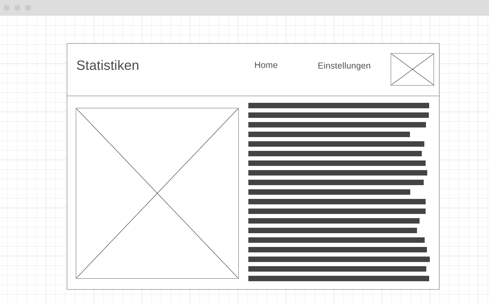

# System-Spezifikation `EMS - Energie Management System`

## 1. Ausgangslage und Zielsetzung

### 1.1. Ist-Situation
Die vorhandenen Komponenten sind:
- Huawei Wechselrichter und Speicher
- KEBA Ladestation

**Es besteht noch kein User Interface für eine derartige Steuerung, dass ist das Ziel des Projekts.**

Ein Energie Management System als Übersicht über die Daten der PV-Anlage. 
Ziel ist es, Daten zusammenzuführen von den verschiedenen Energie Verbrauchern und Energie Generatoren in einem Haushalt. 

Bestehende Systeme sind nur darauf abgestimmt, dass alle Komponenten vom gleichen Hersteller stammen müssen.
Da jedoch sehr viele Komponenten im Einsatz sind, ist es oft sehr schwierig alles nur von einem Hersteller zu verwenden
z.B.: produzieren die wenigsten Wechselrichter Hersteller auch E-Auto Ladestationen und Speicher.

### 1.2. Verbesserungspotenziale

#### Probleme
- Hersteller offenes System zur Steuerung der Energie Verteilung existiert unseres Wissens in dieser Form noch nicht
- Kosten werden nicht gut aufgezeigt
- keine statistischen Informationen

#### Verbesserungen
- Gute Übersicht über den aktuellen Verbrauch / Stromzufuhr
- Verwaltung der Energie
- Ladestand Speicher
- Kompatibilität verschiedener Hersteller ermöglichen

## 2. Zielsetzung

- Das Ziel ist die Steuerung des Batterie Speichers und der Ladestation.
- Das System soll die Priorisierung ermöglichen.
- Unser Ziel ist die Veranschaulichung des Stromverbrauches und des Stromgewinns zu verbessern.
- Selbsterzeugten Strom bestmöglich zu verwenden und erst dann die überschüssige Energie ins Netz einzuspeisen.

## 2. Funktionale Anforderungen

### 2.1. Use Case Überblick

### 2.2.1 GUI-Design

- GUI-Mockup der Statistiken Page (Erster Entwurf)

- GUI-Mockup der Start Seite

### 2.2. Use Case A

Das ist eine Statistik die wir in 4 Statistiken aufteilen werden, das ist nur als Beispiel gedacht umd zu veranschaulichen wie es werden wird, da es bis jetzt noch keine derartigen Auswertungen gibt. Bei den vier Statistiken kann man durch den Use-Case B (Settings) die Eigenschaften der Tabellen ändern um die Energiegewinnung besser darzustellen.
### 2.3. Use Case B

Bei den Settings wird noch ein Bild eingefügt(config). Bei den Settings geht es um die Eigenschaften der Tabelle. Wie die Einheit des Stroms den man produziert oder die Währung. Wie viel man für den Stro bekommt wenn man in weiterverkauft. Weiters kann man den Zeitabschnitt angeben(pro Tag,Monat oder Jahr).

#### 2.2.2 Workflow

- Erklären Sie hier die internen Abläufe, die für die Umsetzung des Use Cases notwendig sind
- Verwenden Sie dazu - wenn der Ablauf komplex genug ist - ein `UML Activity Diagram`
- Beispiel:

## 3. Nicht-funktionale Anforderungen

Nicht-funktionale Anforderungen beschreiben Anforderungen an das System, die nicht-fachlicher Natur sind, jedoch entscheidend zur Anwendbarkeit des Systems beitragen. Sie definieren beispielsweise Qualitätsanforderungen, Sicherheitsanforderungen oder Performanceanforderungen.

Nicht-funktionale Anforderungen definieren grundlegende Eigenschaften eines Systems, die im Architekturentwurf berücksichtigt werden müssen. Da diese Anforderungen auch die Entwicklungskosten beeinflussen (können), müssen sie messbar beschrieben werden.

- FALSCH: Das System muss schnell sein.
- RICHTIG: Daten müssen spätestens innerhalb von 500 ms zurückgegeben werden.

Zur einfachen Strukturierung der Anforderungen werden diejenigen Anforderungen, die nicht eindeutig zu den funktionalen Anforderungen gehören, den nicht-funktionalen Anforderungen zugeordnet.

Hier ein Überblick über mögliche nicht-funktionale Anforderungen:

### `Usability`: Benutzbarkeitsanforderung

- Wie muss die Software beschaffen sein, damit die Zielgruppe gerne damit arbeitet?
- Beispiel:
  - Die Software soll dem Erscheinungsbild anderer Produkte des Herstellers entsprechen.

### `Efficiency`: Effizienzanforderung

- Hier geht es sowohl um Laufzeit- als auch um Speichereffizienz. Was wird unter dem sparsamen Einsatz dieser Ressourcen verstanden?
- Beispiel:
  - Die Berechnung darf nicht länger als 0,25 Sekunden dauern.

### `Maintenance`: Wartbarkeits- und Portierbarkeitsanforderung

- Welcher Grad an Änderbarkeit wird gefordert? Hier werden, soweit wie möglich, kommende Anpassungen und Erweiterungen vorhergesehen.
- Beispiel:
  - Das Produkt soll später auch in englischer Sprache verfügbar sein.

### `Security`: Sicherheitsanforderung

- Zu den Sicherheitsanforderungen gehören die Aspekte Vertraulichkeit, Datenintegrität und Verfügbarkeit.
  - Wie sehr müssen die Daten vor dem Zugriff durch Dritte geschützt werden?
  - Ist es entscheidend, die Korrektheit der erfassten Daten und ihre Konsistenz zu gewährleisten?
  - Dürfen Systemausfälle vorkommen?
- Beispiel:
  - Das System muss gewährleisten, dass Daten nie verändert werden können.

### `Legal`: Gesetzliche Anforderung

- Welche Standards und Gesetze müssen beachtet werden?
- Beispiel:
  - Das Produkt muss die ISO 9000 Norm erfüllen.

## 4. Mengengerüst

Zur Abschätzung der aufkommenden Datenmengen und damit verbunden der notwendigen Infrastruktur, um die nötige Performance zu erzielen, ist ein Mengengerüst zu erstellen. Mögliche Fragestellungen:

- Wieviele User werden erwartet?
- Wieviele Daten pro User werden erwartet?
- Mit welcher Anfrage-Frequenz wird gerechnet?

## 5. Systemarchitektur

- Auflistung der Softwarekomponenten in einem Verteilungsdiagramm (typisch: Client - Server - Datenbank).
- Beispiel:

