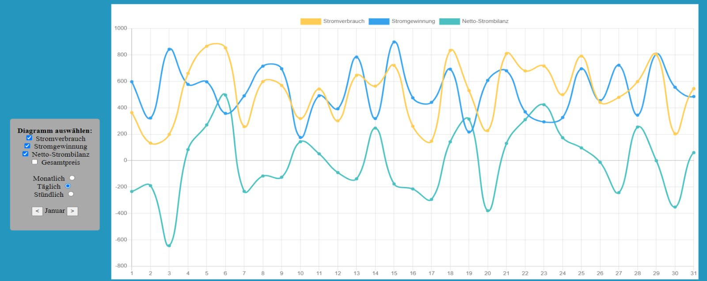
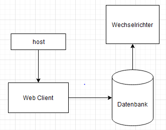

# System-Spezifikation `EMS - Energie Management System`

## 1. Ausgangslage und Zielsetzung

### 1.1. Ist-Situation
Die vorhandenen Komponenten sind:
- Huawei Wechselrichter und Speicher
- KEBA Ladestation

EMS(Energie Management Syste) möchte den User eine besser Übersicht auf die Daten einer PV-Anlage darstellen. Hierzu besteht **noch kein User Interface für eine derartige Steuerung, wie wir es in PLannung haben.** 

Bestehende Systeme sind bis jetzt nur darauf abgestimmt, dass alle Komponenten vom gleichen Hersteller stammen müssen.
Da jedoch sehr viele Komponenten im Einsatz sind, ist es oft sehr schwierig alles nur von einem Hersteller zu verwenden
z.B.: produzieren die wenigsten Wechselrichter Hersteller auch E-Auto Ladestationen und Speicher.

### 1.2. Verbesserungspotenziale

#### Probleme
- Hersteller hat kein offenes System zur Steuerung der Energie 
- keine statistischen Informationen (Kosten, Stromverbrauch, Strombilanz)

#### Verbesserungen
- Gute Übersicht über den aktuellen Verbrauch / Stromzufuhr
- Verwaltung der Energie
- Ladestand des Speichers
- Kompatibilität verschiedener Hersteller ermöglichen

## 2. Zielsetzung
- Steuerung des Batterie Speichers und der Ladestation.
- Das System soll eine Priorisierung ermöglichen.
- Die Veranschaulichung der Daten von der Pv-Anlage
- Selbsterzeugten Strom bestmöglich zu verwenden und erst dann die überschüssige Energie ins Netz einzuspeisen.

## 2. Funktionale Anforderungen

### 2.1. Use Case Überblick

### 2.2.1 GUI-Design

### 2.2. Use Case Statistik

Es wird von der Datenbank eine Statistik generiert, die durch Auswahlmöglichkeiten veränderbar ist. Dies geschieht durch abhackerln der jeweiligen Alternativen auf der rechten Seite. Weiters kann das Jahr,der Monat oder der jeweilige Tag die Statistik verändern. Dies geschieht durch klicken auf den jewiligen Punkt und darunter kann man den Monat auswählen, der durch Pfeiltasten zum nächsten oder vorherigen Monat springt.  
### 2.3. Use Case Settings

 Bei den Settings geht es um die Eigenschaften der Tabelle. Wie die Einheit des Stroms den man produziert oder eine Darstellung der Kosten. Hierzu kann man die Währung ändern, um zu wissen wie viel man für den Strom den man gewonnen hat bekommt. Weiters kann man den Default-Zeitabschnitt angeben (pro Monat oder Jahr) wenn man auf die Website kommt.

### 2.4 Workflow
Durch das Hackerln der verschiedenen Eigenschaften der Tabelle (Stromverbrauch, Strommgewinnung, Netto-Strombilanz, Gesamtpreis) wird das gegebene Diagramm geändert. Weiters auch durch das Anklicken von Monat und Jahr. Durch das Zahnrad oben rechts neben dem Logo können die Default-Settings eingestellt werden. Durch drauf Klicken auf das jeweilige Einheit wird sich ein Dropdown button öffnen, wo der User die jeweilige Einheit auswählen kann.

## 3. Nicht-funktionale Anforderungen

### `Usability`: Benutzbarkeitsanforderung
- Die Statistiken der Website sollten übersichtlich und     informationsreich dargestellt sein (Benutzerfreundlich)

### `Efficiency`: Effizienzanforderung

- Das Auswerten der Daten darf nicht länger als 5 Sekunden benötigen um den Benutzer nicht abzuschrecken -> Datenbank erstellen

### `Maintenance`: Wartbarkeits- und Portierbarkeitsanforderung

- Es müssen neue Daten vom Wechselrichter zur Datenbank hinzugefügt werden können ohne viel Aufwand zu betreiben

- Eine Steuerung, wo der Strom hingeleitet werden soll
### `Security`: Sicherheitsanforderung

- Das System muss gewhärleisten das der Benutzer auf seine Daten zugreifen kann und sonst kein anderer

- Virenfreie Daten hochladen

- Sichere Verbindung zum Server

### `Legal`: Gesetzliche Anforderung

- Die Datenschutzerklärung muss eingehalten werden

## 4. Mengengerüst
- Es wird vom Raspberry Pi stündlich ein Datensatz von dem Wechselrichter auf die Datenbank gespeichert. Es ist nur jeder Stunde um die Wartezeit zu verkürzen. Hierbei wird nur ein Benutzer auf der Website erwartet.
## 5. Systemarchitektur

## 6. Datenmodell

